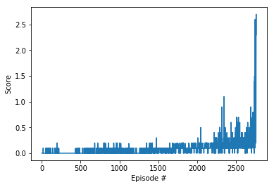

# Project 3 Report - Tennis
For this project, we will work with the [Tennis](https://github.com/Unity-Technologies/ml-agents/blob/master/docs/Learning-Environment-Examples.md#tennis) environment.

In this environment, two agents control rackets to bounce a ball over a net. If an agent hits the ball over the net, it receives a reward of +0.1.  If an agent lets a ball hit the ground or hits the ball out of bounds, it receives a reward of -0.01.  Thus, the goal of each agent is to keep the ball in play.

The observation space consists of 8 variables corresponding to the position and velocity of the ball and racket. Each agent receives its own, local observation.  Two continuous actions are available, corresponding to movement toward (or away from) the net, and jumping. 

The task is episodic, and in order to solve the environment, your agents must get an average score of +0.5 (over 100 consecutive episodes, after taking the maximum over both agents). Specifically,

- After each episode, we add up the rewards that each agent received (without discounting), to get a score for each agent. This yields 2 (potentially different) scores. We then take the maximum of these 2 scores.
- This yields a single **score** for each episode.

The environment is considered solved, when the average (over 100 episodes) of those **scores** is at least +0.5.

## Learning Algorithm
In this project, I used the Deep Deterministic Policy Gradients (GGPG) learning algorithm to solve the Tennis environment. DDPG is an off-policy model-free algorithm that uses neural networks to learn policies, even in high-dimensional and continuous action spaces. This implementation has two DDPG agents (one for each player) with shared actor and critic networks. 

Each agent uses the same actor network to take an action, sampled from a shared replay buffer. 

## Model Architecture
The model is composed of two networks the Actor and the Critic Network. Actor network takes an observation of the Unity Agent as an input and outputs an action. Critic network is used to compute advantage for state value estimation.

### Actor Network
- 3 Fully connected layer
    - Fully connected layer - input: 24 (state size) output: 256
    - Fully connected layer - input: 256 output 128
    - Fully connected layer - input: 128 output: (action size -> 2)
    - Each fully connected layer is activated by ReLU and The last one is tanh.

### Critic Network
- 3 Fully connected layer
    - Fully connected layer - input: 24 (state size) output: 256
    - Fully connected layer - input: 256+2 output 128
    - Fully connected layer - input: 128 output: 1
    - Each fully connected layer is activated by ReLU and The last one does not activate.
    
This critic network takes only the state as input to the first layer and the action contribution is added only after the first layer.

## Hyperparameters
- BUFFER_SIZE = int(1e5)  # replay buffer size
- BATCH_SIZE = 128        # minibatch size
- GAMMA = 0.99            # discount factor
- TAU = 1e-3              # for soft update of target parameters
- LR_ACTOR = 8e-5        # learning rate of the actor 
- LR_CRITIC = 8e-5        # learning rate of the critic
- WEIGHT_DECAY = 0.00000   # L2 weight decay

## Experiments

In this project I did experiment with different values for the various hyperparemeters and different configuration for the Actor and Critic network. I started with 512 and 256 nodes in the second and third hidden layer respectively. But the training process was slow and the environment could not be solved even after 2000 episodes. Hence, reduced the nodes by half. With this, though the  environment was solved only after 2760 episodes, the overall time taken was less.

## Results
The training process was acceptably fast and the environment was solved (average score of 100 consecutive episodes crossed 0.5) after 2760 episodes.

## Future Work
- Experiment with other learning algorithm (ex. PPO)
- Further Reduce learning time by more adjusting hyper parameters and tuning the network.
- Attempt and solve the Football environment. I think this would be challenging as the environment not only collaborative between players in the same team but is also competitive between players of opposite teams.
